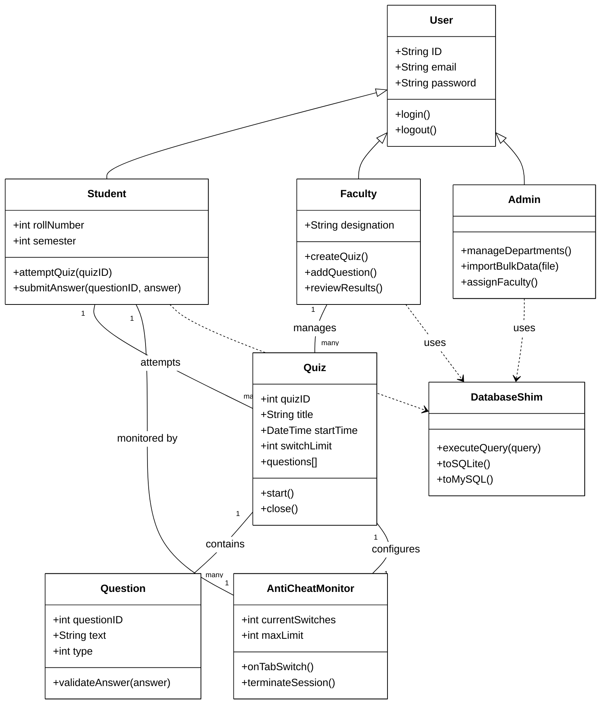

# Class Diagram - Conceptual Model

This diagram illustrates the logical structure of the application's components and their relationships.

---
### Structural Overview:
- **Inheritance**: All user types inherit from a base `User` class for shared authentication logic.
- **Composition**: A `Quiz` is composed of multiple `Question` objects.
- **Dependency**: The system relies on the `DatabaseShim` for environment-agnostic data access.
- **Monitoring**: The `AntiCheatMonitor` is the bridge between the `Quiz` configuration and the active `Student` session.
