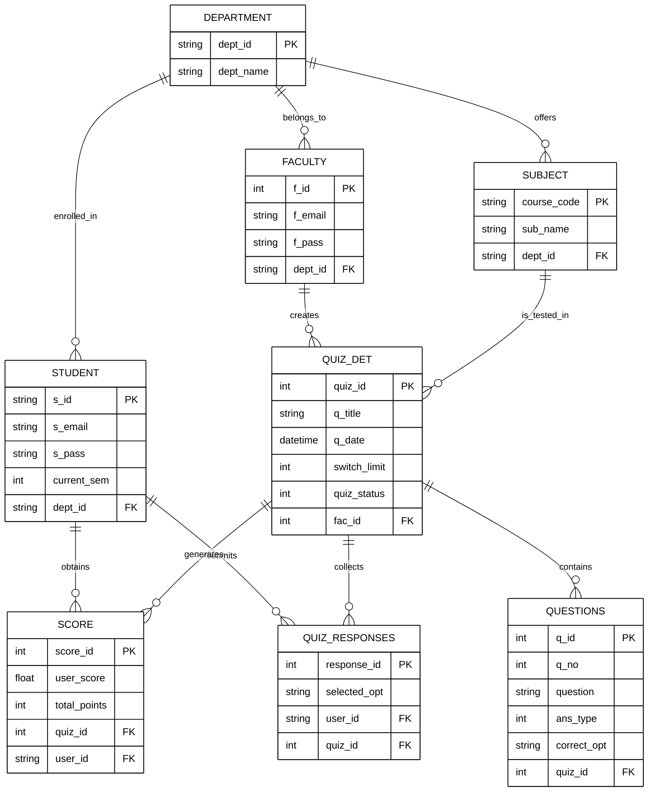

# ER Diagram - System Schema

This diagram represents the relational structure of the database tables and their interconnections.

---
### Key Relationships:
- **Normalization**: The schema is normalized to ensure data integrity across departments and subjects.
- **Traceability**: Every score and response is tied to both a student and a specific quiz instance.
- **Configuration**: `QUIZ_DET` serves as the configuration hub for the anti-cheating engine.
