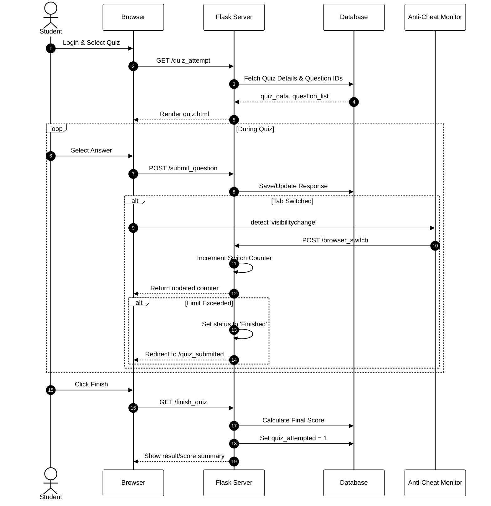

# Sequence Diagram - Quiz Attempt Flow

This diagram tracks the lifecycle of a single quiz attempt, highlighting the communication between the browser, server, and database.

---
### Flow Significance:
1. **Initialization**: The server shuffles questions and initializes the session to prevent static pattern cheating.
2. **Real-time Sync**: Every question submission is saved immediately, ensuring no data loss if the student's connection drops.
3. **Integrity Enforcement**: The `Anti-Cheat Monitor` acts as an asynchronous watchdog, communicating directly with the session to enforce rules without interrupting the legitimate flow.
