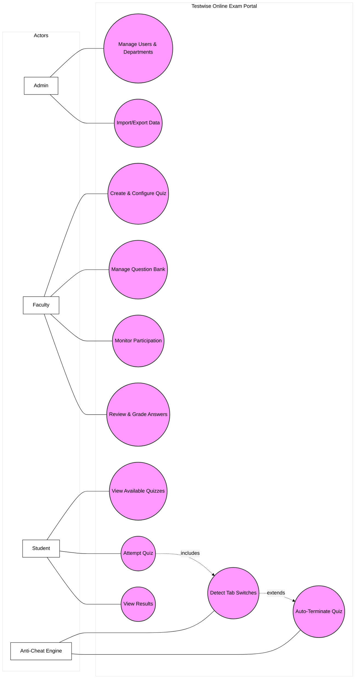

# Use Case Diagram - Testwise

This diagram illustrates the primary interactions between the different users (Actors) and the system.

---
### Use Case Descriptions:
- **Admin**: Focuses on the structural setup of the portal, ensuring departments and users are correctly provisioned.
- **Faculty**: Handles the academic core—creating assessments and evaluating performance.
- **Student**: The primary consumer of the quiz engine, subject to the monitoring constraints.
- **Anti-Cheat Engine**: An automated background actor that enforces integrity rules during active attempts.
