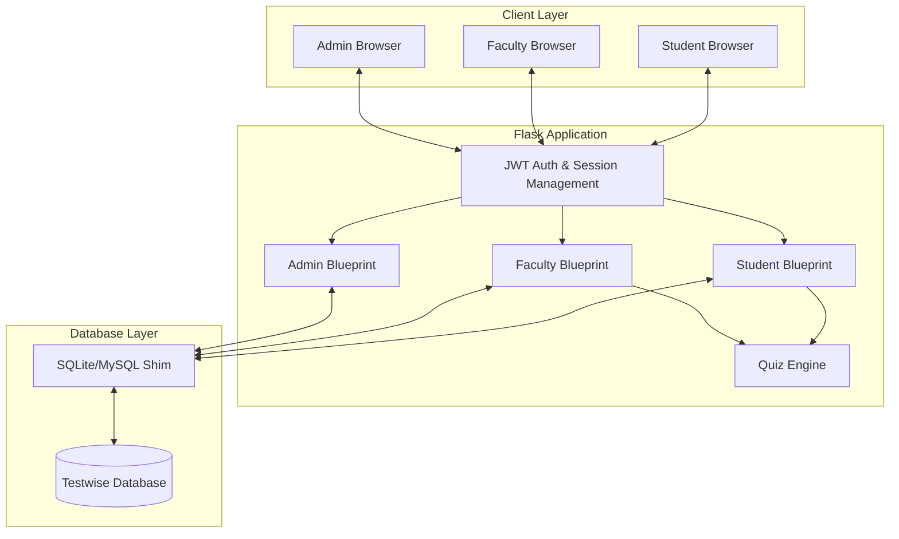

# 🎓 Testwise: Online Exam Portal with Anti-Cheating

[](https://flask.palletsprojects.com/)
[](https://www.mysql.com/)
[](https://www.sqlite.org/)
[](https://developer.mozilla.org/en-US/docs/Web/JavaScript)

**Testwise** is a robust, secure, and feature-rich online examination platform designed to provide a seamless testing experience for students while ensuring academic integrity through advanced anti-cheating mechanisms.

---

## 🏗️ Architecture Diagram



---

## 🛠️ Technology Stack

| Component | Technology | Utilization |
| :--- | :--- | :--- |
| **Backend** | Flask (Python) | Core application logic, routing, and API endpoints. |
| **Database** | MySQL / SQLite | Data persistence for users, quizzes, and responses. Uses a custom shim for cross-compatibility. |
| **Authentication** | JWT & Flask-Session | Secure role-based access control and persistent session management. |
| **Frontend** | HTML5, SCSS, Vanilla JS | Responsive UI/UX with modern aesthetics and real-time anti-cheat monitoring. |
| **Data Processing** | Openpyxl, xlrd | Bulk data import and export via Excel for Admin and Faculty. |
| **Emailing** | Flask-Mail | Password resets and communication notifications. |

---

## 🔄 User Workflows & Functions

### 👑 Admin (System Administrator)
*   **Master Data Management**: Centralized control over Departments, Students, Faculty, and Subjects.
*   **Bulk Operations**: Import/Export large datasets (students, subjects) using Excel spreadsheets.
*   **System Configuration**: Assign faculty to subjects and manage academic structures.
*   **Security**: Oversee system access and manage administrative credentials.

### 👨‍🏫 Faculty (Examiner)
*   **Quiz Creation**: Comprehensive quiz builder with support for MCQ, One-line, and Descriptive questions.
*   **Anti-Cheating Controls**: Set tab-switch limits and per-question timers.
*   **Real-time Monitoring**: Track student participation and submission status.
*   **Result Analytics**: Detailed performance reports with distinction/pass/fail statistics and leaderboards.
*   **Subjective Evaluation**: Review and grade descriptive answers submitted as text or files.

### 🎓 Student (Examinee)
*   **Secure Attempt**: Participate in scheduled quizzes with real-time feedback.
*   **Anti-Cheat Environment**: Built-in tab-switch detection that auto-terminates or warns on violations.
*   **Progress Tracking**: Interactive quiz interface showing time remaining and attempted questions.
*   **Result Access**: View scores and feedback immediately after faculty approval.

---

## 📊 Database Schema

| Table Name | Description |
| :--- | :--- |
| `admin` | Stores administrative credentials and profile data. |
| `student` | Comprehensive student records (Roll, Batch, Dept, Credentials). |
| `faculty` | Faculty profiles and designation details. |
| `department` | Academic department metadata and duration. |
| `subject` | Course details including type (Theory/Practical) and elective status. |
| `quiz_det` | Core quiz configuration (Title, Timing, Anti-cheat settings). |
| `questions` | Question bank with options, correct answers, and point weights. |
| `quiz_responses` | Student-submitted answers mapped to specific quiz sessions. |
| `score` | Final calculated scores, time taken, and attempt status. |

---

## 💡 Why Testwise?

### How it Works
Testwise utilizes a **State-Sync Architecture**. While the student attempts the quiz, their progress is synchronized with the server in real-time. The anti-cheating module monitors the browser's `visibilityState` and `blur`/`focus` events. If a student attempts to switch tabs or windows, the system logs the event and increments a violation counter.

### Why this Approach?
Traditional online portals often rely solely on client-side alerts which can be bypassed. Testwise integrates anti-cheating logic directly into the **session layer**. 
1.  **Tab Switch Limit**: Automatically submits the quiz if the student exceeds the faculty-defined threshold.
2.  **Per-Question Timers**: Prevents students from searching for answers externally by limiting the time available for each query.
3.  **Cross-Database Shim**: Our unique SQLite/MySQL shim allows the project to be deployed seamlessly in both lightweight local environments and robust production servers without code changes.

### Why it's Better
*   **Role-Based Isolation**: Using Flask Blueprints ensures that Admin, Faculty, and Student modules are completely decoupled, enhancing security and maintainability.
*   **Zero Placeholder Policy**: No generic "lorem ipsum"—every feature is built with real academic workflows in mind, from elective subject management to descriptive answer file uploads.
*   **Scalability**: Optimized queries and session handling allow the platform to support hundreds of concurrent examinees.

---

## 🚀 Getting Started

1.  **Clone the Repo**:
    ```bash
    git clone https://github.com/yourusername/Testwise.git
    cd Testwise
    ```
2.  **Install Dependencies**:
    ```bash
    pip install -r requirements.txt
    ```
3.  **Setup Environment**:
    Create a `.env` file with your `APP_SECRET_KEY` and database credentials.
4.  **Run the App**:
    ```bash
    python app.py
    ```

---

<div align="center">
  <sub>Built for a fairer academic world.</sub>
</div>
